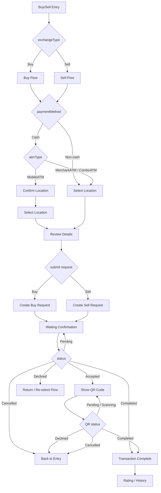
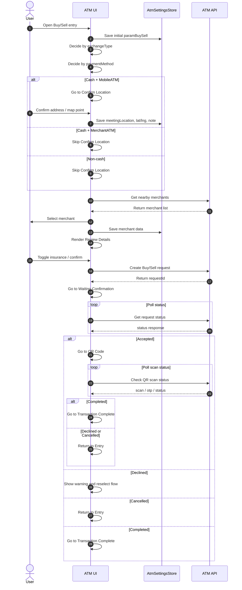
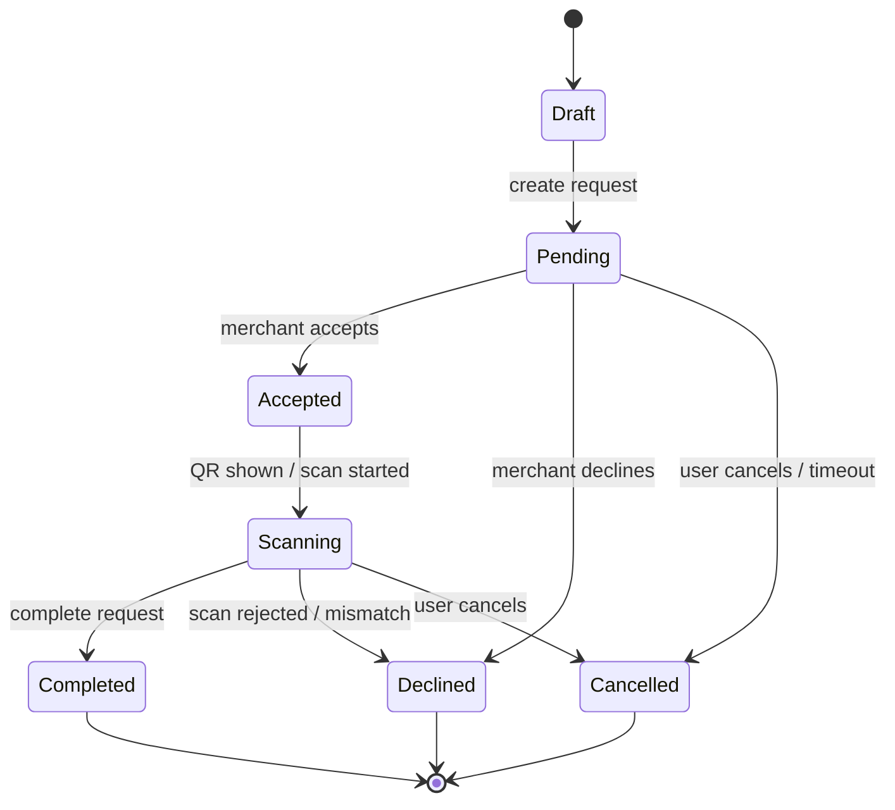
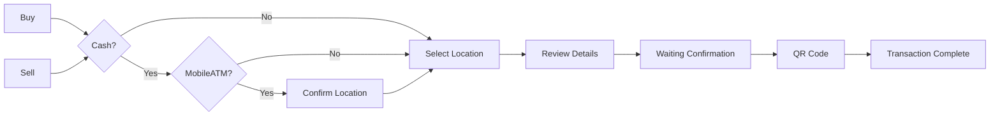

# ATM Buy/Sell Mermaid Diagram

## 1. Overview

## 2. Buy / Sell Sequence

## 3. Status Transition Map

## 4. Case Matrix

## 5. Notes

- Diagram này phản ánh flow hiện tại của frontend, không phải business model tổng quát.
- Nếu backend đổi status machine, cần cập nhật lại các nhánh `Pending / Accepted / Declined / Cancelled / Completed`.
- Nếu product thay đổi rule cash/non-cash, cần cập nhật node `Confirm Location` và `Select Location`.
